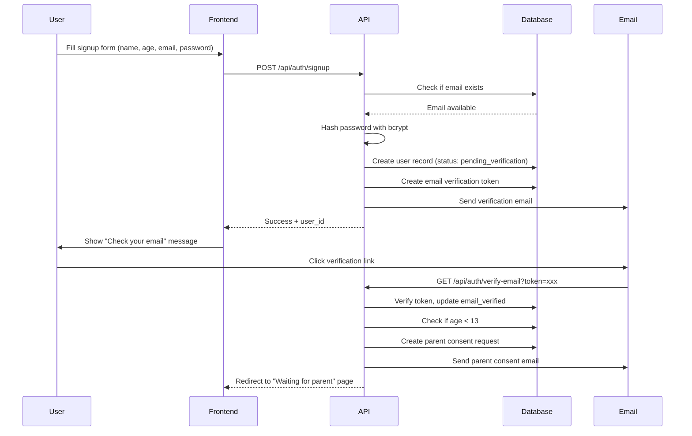
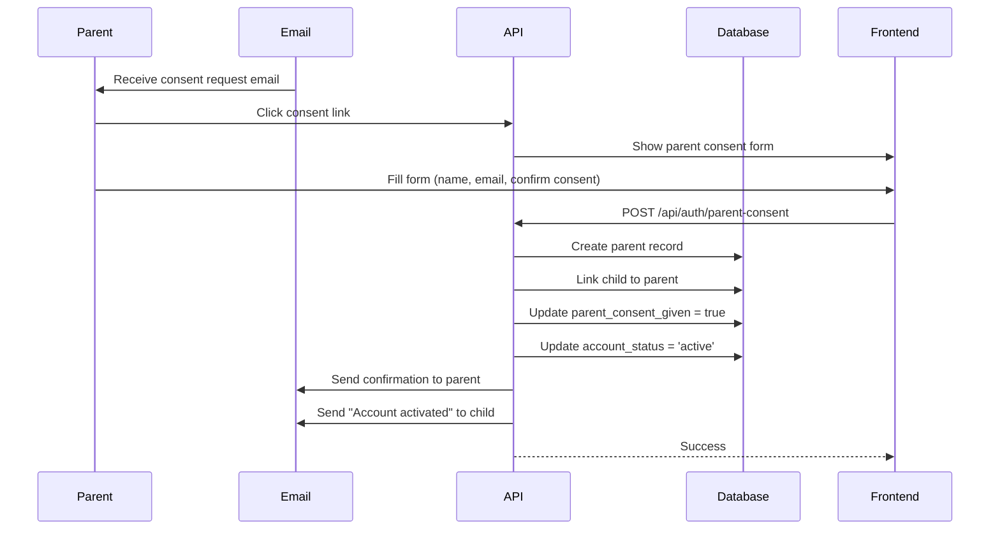
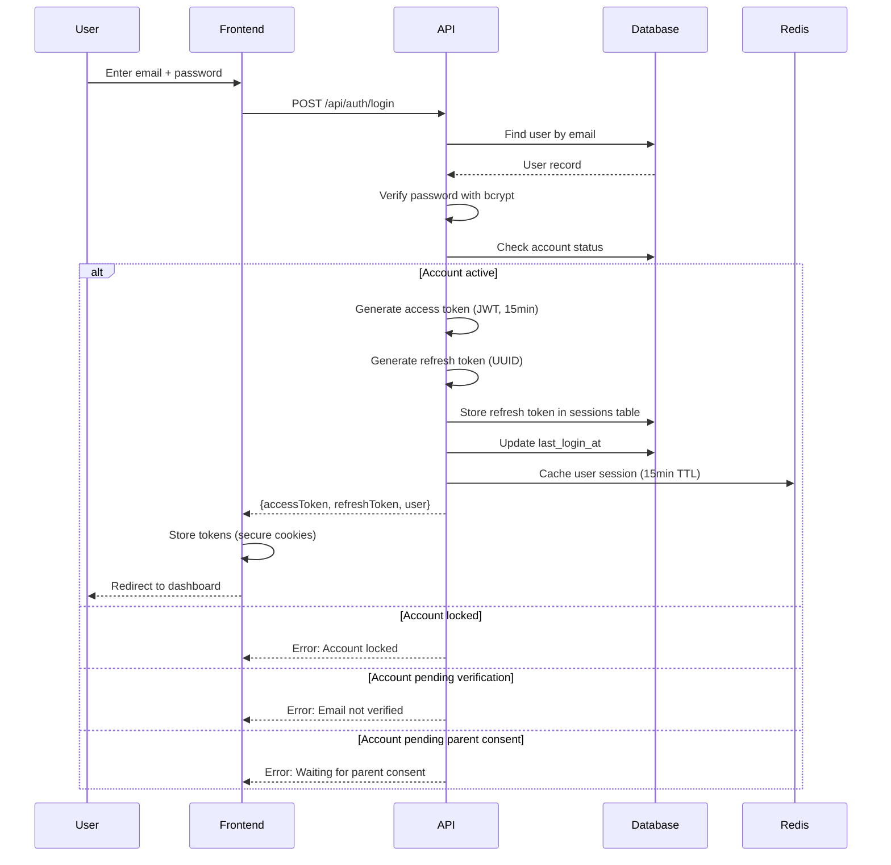
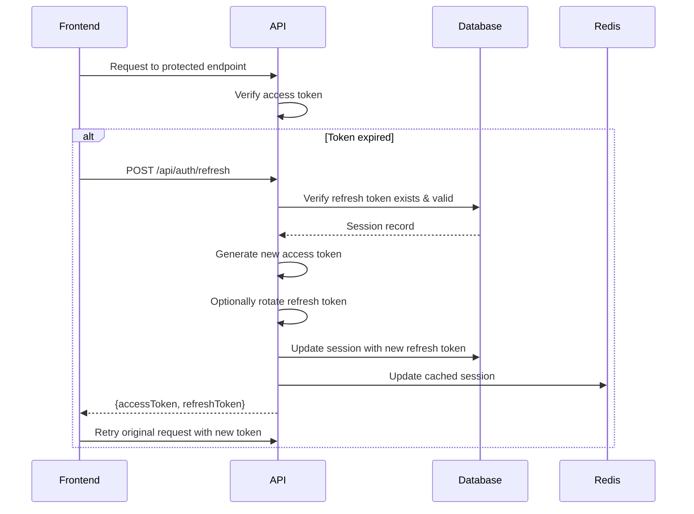
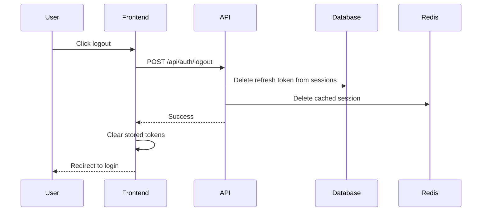

# Authentication System - Education for the Age of AI

## 🔐 Overview

Complete authentication system with COPPA compliance, secure session management, and parent verification.

**Security Features:**
- JWT access tokens (short-lived: 15 min)
- Refresh tokens (long-lived: 30 days)
- bcrypt password hashing (cost factor 12)
- Rate limiting on authentication endpoints
- CSRF protection
- Email verification
- Parent consent workflow (COPPA)
- Account lockout after failed attempts

---

## 🚀 Authentication Flow

### 1. User Signup Flow (Under 13)



---

### 2. Parent Consent Flow (COPPA Compliance)



---

### 3. Login Flow



---

### 4. Token Refresh Flow



---

### 5. Logout Flow



---

## 🔑 JWT Token Structure

### Access Token Payload

```javascript
{
  // Standard claims
  "iss": "education-ai.com",          // Issuer
  "sub": "uuid-of-user",              // Subject (user ID)
  "aud": "education-ai-frontend",     // Audience
  "exp": 1704123600,                  // Expiration (15 min from now)
  "iat": 1704122700,                  // Issued at
  "jti": "unique-token-id",           // JWT ID (for revocation)

  // Custom claims
  "userId": "uuid-of-user",
  "email": "user@example.com",
  "role": "student",
  "accountStatus": "active",
  "level": 5,
  "parentId": "uuid-of-parent"        // If child account
}
```

### Refresh Token

- **Format:** Random UUID (not JWT)
- **Storage:** Database `sessions` table
- **Expiration:** 30 days
- **Rotation:** Optional - generate new refresh token on each use
- **Revocation:** Delete from database

---

## 🛡️ Security Implementation

### Password Hashing

```javascript
import bcrypt from 'bcrypt';

const SALT_ROUNDS = 12;

// Hash password on signup
async function hashPassword(plainPassword) {
  const salt = await bcrypt.genSalt(SALT_ROUNDS);
  const hash = await bcrypt.hash(plainPassword, salt);
  return hash;
}

// Verify password on login
async function verifyPassword(plainPassword, hashedPassword) {
  return await bcrypt.compare(plainPassword, hashedPassword);
}
```

---

### JWT Generation & Verification

```javascript
import jwt from 'jsonwebtoken';

const ACCESS_TOKEN_SECRET = process.env.ACCESS_TOKEN_SECRET;
const REFRESH_TOKEN_SECRET = process.env.REFRESH_TOKEN_SECRET;
const ACCESS_TOKEN_EXPIRY = '15m';
const REFRESH_TOKEN_EXPIRY = '30d';

// Generate access token
function generateAccessToken(user) {
  const payload = {
    userId: user.id,
    email: user.email,
    role: 'student',
    accountStatus: user.account_status,
    level: user.level || 1,
    parentId: user.parent_id
  };

  return jwt.sign(payload, ACCESS_TOKEN_SECRET, {
    expiresIn: ACCESS_TOKEN_EXPIRY,
    issuer: 'education-ai.com',
    audience: 'education-ai-frontend',
    jwtid: generateJTI()
  });
}

// Generate refresh token
function generateRefreshToken() {
  return crypto.randomUUID();
}

// Verify access token
function verifyAccessToken(token) {
  try {
    return jwt.verify(token, ACCESS_TOKEN_SECRET, {
      issuer: 'education-ai.com',
      audience: 'education-ai-frontend'
    });
  } catch (error) {
    throw new Error('Invalid or expired token');
  }
}

// Generate unique JWT ID
function generateJTI() {
  return crypto.randomUUID();
}
```

---

### Rate Limiting

```javascript
import rateLimit from 'express-rate-limit';

// Login endpoint - prevent brute force
const loginLimiter = rateLimit({
  windowMs: 15 * 60 * 1000, // 15 minutes
  max: 5, // 5 attempts per window
  message: {
    error: 'Too many login attempts. Try again in 15 minutes.'
  },
  standardHeaders: true,
  legacyHeaders: false
});

// Signup endpoint - prevent spam
const signupLimiter = rateLimit({
  windowMs: 60 * 60 * 1000, // 1 hour
  max: 3, // 3 signups per hour per IP
  message: {
    error: 'Too many accounts created. Try again later.'
  }
});

// Password reset - prevent abuse
const resetLimiter = rateLimit({
  windowMs: 60 * 60 * 1000, // 1 hour
  max: 3, // 3 reset requests per hour
  message: {
    error: 'Too many password reset requests. Try again in an hour.'
  }
});

// Apply to routes
app.post('/api/auth/login', loginLimiter, loginController);
app.post('/api/auth/signup', signupLimiter, signupController);
app.post('/api/auth/forgot-password', resetLimiter, forgotPasswordController);
```

---

### Account Lockout After Failed Attempts

```javascript
async function handleFailedLogin(userId) {
  const user = await db.users.findUnique({ where: { id: userId } });

  const failedAttempts = user.failed_login_attempts + 1;

  if (failedAttempts >= 5) {
    // Lock account for 30 minutes
    const lockUntil = new Date(Date.now() + 30 * 60 * 1000);

    await db.users.update({
      where: { id: userId },
      data: {
        failed_login_attempts: failedAttempts,
        account_locked_until: lockUntil
      }
    });

    throw new Error('Account locked due to too many failed attempts. Try again in 30 minutes.');
  } else {
    await db.users.update({
      where: { id: userId },
      data: { failed_login_attempts: failedAttempts }
    });

    throw new Error(`Incorrect password. ${5 - failedAttempts} attempts remaining.`);
  }
}

async function handleSuccessfulLogin(userId) {
  await db.users.update({
    where: { id: userId },
    data: {
      failed_login_attempts: 0,
      account_locked_until: null,
      last_login_at: new Date(),
      last_login_ip: req.ip
    }
  });
}
```

---

### CSRF Protection

```javascript
import csurf from 'csurf';
import cookieParser from 'cookie-parser';

// Setup CSRF protection
const csrfProtection = csurf({
  cookie: {
    httpOnly: true,
    secure: process.env.NODE_ENV === 'production',
    sameSite: 'strict'
  }
});

app.use(cookieParser());

// Get CSRF token endpoint (for SPA)
app.get('/api/auth/csrf-token', csrfProtection, (req, res) => {
  res.json({ csrfToken: req.csrfToken() });
});

// Protect state-changing routes
app.post('/api/auth/signup', csrfProtection, signupController);
app.post('/api/auth/login', csrfProtection, loginController);
app.post('/api/auth/logout', csrfProtection, logoutController);
```

---

## 🍪 Cookie Configuration

```javascript
// Secure cookie settings for production
const cookieOptions = {
  httpOnly: true,                    // Not accessible via JavaScript
  secure: process.env.NODE_ENV === 'production', // HTTPS only in production
  sameSite: 'strict',                // CSRF protection
  maxAge: 30 * 24 * 60 * 60 * 1000,  // 30 days
  path: '/'
};

// Set refresh token in secure cookie
function setRefreshTokenCookie(res, refreshToken) {
  res.cookie('refreshToken', refreshToken, cookieOptions);
}

// Clear cookies on logout
function clearAuthCookies(res) {
  res.clearCookie('refreshToken', { path: '/' });
  res.clearCookie('accessToken', { path: '/' });
}
```

---

## 🔒 Middleware

### Auth Middleware (Protect Routes)

```javascript
import jwt from 'jsonwebtoken';

async function authMiddleware(req, res, next) {
  try {
    // Extract token from Authorization header
    const authHeader = req.headers.authorization;
    if (!authHeader || !authHeader.startsWith('Bearer ')) {
      return res.status(401).json({ error: 'No token provided' });
    }

    const token = authHeader.substring(7); // Remove 'Bearer '

    // Verify token
    const decoded = jwt.verify(token, process.env.ACCESS_TOKEN_SECRET);

    // Check if user still exists and is active
    const user = await db.users.findUnique({
      where: { id: decoded.userId },
      select: { id: true, account_status: true, email: true }
    });

    if (!user) {
      return res.status(401).json({ error: 'User not found' });
    }

    if (user.account_status !== 'active') {
      return res.status(403).json({ error: 'Account not active' });
    }

    // Attach user to request
    req.user = {
      userId: decoded.userId,
      email: decoded.email,
      role: decoded.role,
      parentId: decoded.parentId
    };

    next();
  } catch (error) {
    if (error.name === 'TokenExpiredError') {
      return res.status(401).json({ error: 'Token expired', code: 'TOKEN_EXPIRED' });
    }
    if (error.name === 'JsonWebTokenError') {
      return res.status(401).json({ error: 'Invalid token' });
    }
    return res.status(500).json({ error: 'Authentication error' });
  }
}

// Usage
app.get('/api/user/profile', authMiddleware, profileController);
```

---

### Parent-Only Middleware

```javascript
async function parentAuthMiddleware(req, res, next) {
  try {
    const authHeader = req.headers.authorization;
    const token = authHeader?.substring(7);

    const decoded = jwt.verify(token, process.env.ACCESS_TOKEN_SECRET);

    // Verify parent account
    const parent = await db.parents.findUnique({
      where: { id: decoded.userId }
    });

    if (!parent) {
      return res.status(403).json({ error: 'Parent access required' });
    }

    req.parent = {
      parentId: parent.id,
      email: parent.email,
      accountType: parent.account_type
    };

    next();
  } catch (error) {
    return res.status(401).json({ error: 'Invalid parent token' });
  }
}
```

---

## 📧 Email Templates

### Email Verification Template

```html
<!DOCTYPE html>
<html>
<head>
  <style>
    body { font-family: 'Fredoka', Arial, sans-serif; background: #F5F7FA; }
    .container { max-width: 600px; margin: 0 auto; background: white; padding: 40px; }
    .button { background: #2D9CDB; color: white; padding: 14px 32px; border-radius: 24px; text-decoration: none; display: inline-block; }
  </style>
</head>
<body>
  <div class="container">
    <h1>🤖 Welcome to Education for the Age of AI!</h1>
    <p>Hi {{firstName}},</p>
    <p>You're almost ready to start learning! Click the button below to verify your email:</p>
    <p>
      <a href="{{verificationLink}}" class="button">Verify Email</a>
    </p>
    <p>Or copy this link: {{verificationLink}}</p>
    <p>This link expires in 24 hours.</p>
    <p>See you soon!<br>Clai & the Education AI Team</p>
  </div>
</body>
</html>
```

---

### Parent Consent Request Template

```html
<!DOCTYPE html>
<html>
<body>
  <div class="container">
    <h1>🛡️ Parental Consent Required</h1>
    <p>Hi Parent/Guardian,</p>
    <p>Your child, <strong>{{childName}}</strong> (age {{childAge}}), has created an account on Education for the Age of AI.</p>
    <p>Because they're under 13, we need your permission before they can start learning (required by COPPA law).</p>

    <h2>What is this platform?</h2>
    <p>Education for the Age of AI teaches kids (ages 7-14) about artificial intelligence, digital safety, and critical thinking online. It's safe, ad-free, and designed by educators.</p>

    <h2>What we collect</h2>
    <ul>
      <li>First name (for personalization)</li>
      <li>Age range (to show appropriate content)</li>
      <li>Learning progress (to track growth)</li>
      <li>Your email (for consent and updates)</li>
    </ul>
    <p>We NEVER sell data or show ads. <a href="{{privacyPolicyLink}}">Read our privacy policy</a></p>

    <p>
      <a href="{{consentLink}}" class="button">Give Permission</a>
    </p>

    <p>Questions? <a href="mailto:support@education-ai.com">Contact us</a></p>
  </div>
</body>
</html>
```

---

### Password Reset Template

```html
<!DOCTYPE html>
<html>
<body>
  <div class="container">
    <h1>🔒 Reset Your Password</h1>
    <p>Hi {{firstName}},</p>
    <p>We received a request to reset your password. Click below to create a new one:</p>
    <p>
      <a href="{{resetLink}}" class="button">Reset Password</a>
    </p>
    <p>This link expires in 1 hour.</p>
    <p>If you didn't request this, ignore this email. Your password won't change.</p>
    <p>Stay safe!<br>Clai & the Education AI Team</p>
  </div>
</body>
</html>
```

---

## 🔄 Session Management

### Store Session in Database

```javascript
async function createSession(userId, refreshToken, req) {
  const expiresAt = new Date(Date.now() + 30 * 24 * 60 * 60 * 1000); // 30 days

  await db.sessions.create({
    data: {
      user_id: userId,
      refresh_token: refreshToken,
      ip_address: req.ip,
      user_agent: req.headers['user-agent'],
      expires_at: expiresAt,
      is_active: true
    }
  });
}

async function invalidateSession(refreshToken) {
  await db.sessions.update({
    where: { refresh_token: refreshToken },
    data: { is_active: false }
  });
}

async function cleanupExpiredSessions() {
  await db.sessions.deleteMany({
    where: {
      expires_at: { lt: new Date() }
    }
  });
}

// Run cleanup daily
setInterval(cleanupExpiredSessions, 24 * 60 * 60 * 1000);
```

---

### Cache Session in Redis (Optional)

```javascript
import Redis from 'ioredis';

const redis = new Redis(process.env.REDIS_URL);

async function cacheUserSession(userId, userData) {
  const key = `session:${userId}`;
  const ttl = 15 * 60; // 15 minutes (match access token expiry)

  await redis.setex(key, ttl, JSON.stringify(userData));
}

async function getCachedSession(userId) {
  const key = `session:${userId}`;
  const data = await redis.get(key);
  return data ? JSON.parse(data) : null;
}

async function invalidateCachedSession(userId) {
  const key = `session:${userId}`;
  await redis.del(key);
}
```

---

## 🧪 Testing Auth Flow

### Example Test Cases

```javascript
import request from 'supertest';
import app from '../app';

describe('Authentication', () => {
  describe('POST /api/auth/signup', () => {
    it('should create a new user account', async () => {
      const res = await request(app)
        .post('/api/auth/signup')
        .send({
          firstName: 'Alex',
          age: 10,
          email: 'alex@example.com',
          password: 'SecurePass123!'
        });

      expect(res.status).toBe(201);
      expect(res.body).toHaveProperty('userId');
      expect(res.body.message).toBe('Account created. Check your email to verify.');
    });

    it('should reject duplicate email', async () => {
      // Create first user
      await request(app)
        .post('/api/auth/signup')
        .send({
          firstName: 'Alex',
          age: 10,
          email: 'alex@example.com',
          password: 'SecurePass123!'
        });

      // Try to create duplicate
      const res = await request(app)
        .post('/api/auth/signup')
        .send({
          firstName: 'Alex2',
          age: 11,
          email: 'alex@example.com',
          password: 'SecurePass456!'
        });

      expect(res.status).toBe(400);
      expect(res.body.error).toBe('Email already exists');
    });
  });

  describe('POST /api/auth/login', () => {
    it('should login with correct credentials', async () => {
      // Create and verify user first
      // ... setup code ...

      const res = await request(app)
        .post('/api/auth/login')
        .send({
          email: 'alex@example.com',
          password: 'SecurePass123!'
        });

      expect(res.status).toBe(200);
      expect(res.body).toHaveProperty('accessToken');
      expect(res.body).toHaveProperty('refreshToken');
      expect(res.body.user.email).toBe('alex@example.com');
    });

    it('should reject incorrect password', async () => {
      const res = await request(app)
        .post('/api/auth/login')
        .send({
          email: 'alex@example.com',
          password: 'WrongPassword!'
        });

      expect(res.status).toBe(401);
      expect(res.body.error).toContain('Incorrect password');
    });
  });
});
```

---

This authentication system provides enterprise-grade security while maintaining a smooth user experience and full COPPA compliance for child users.
